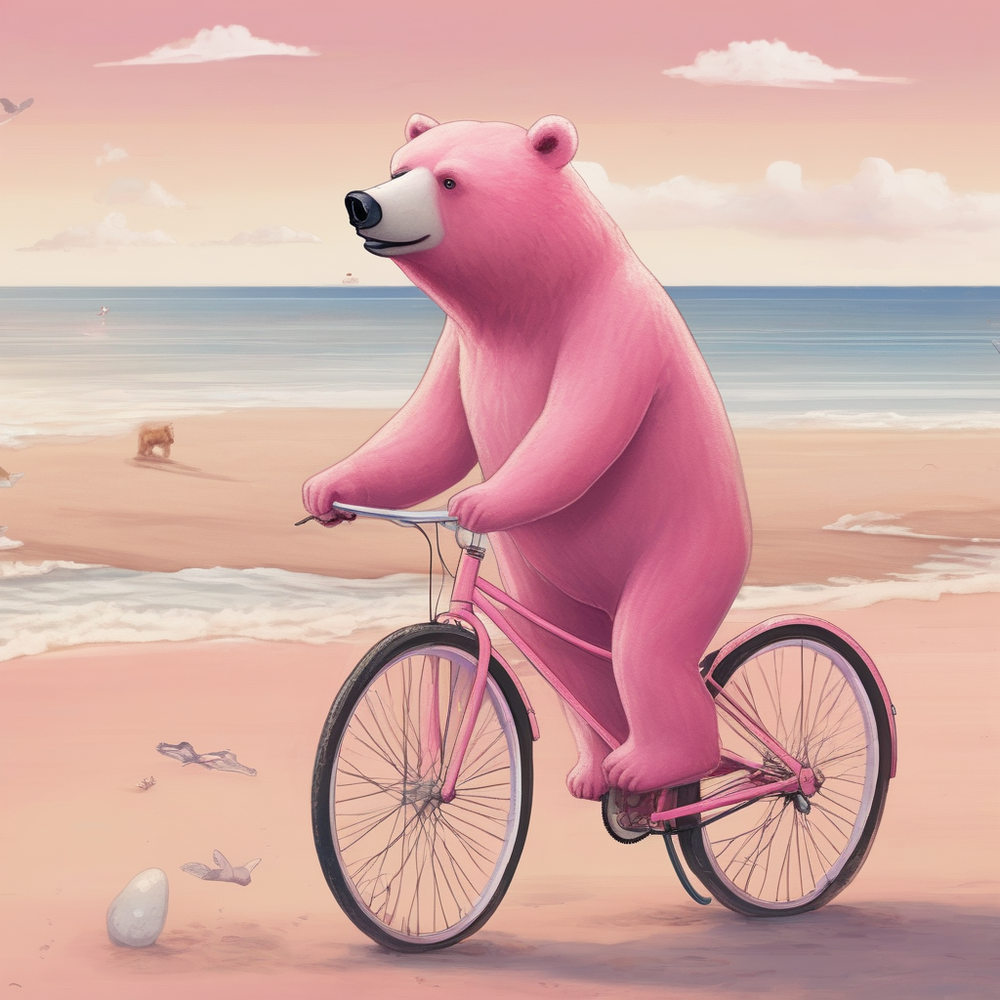
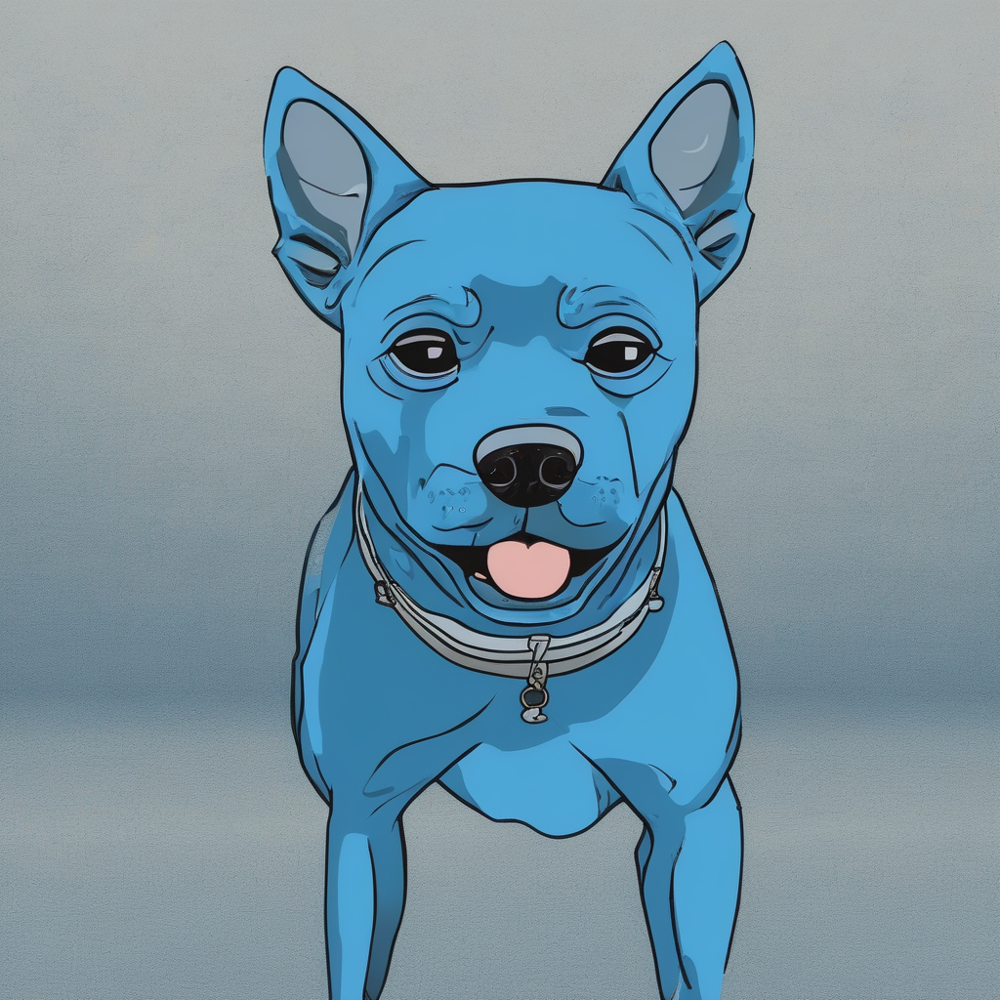
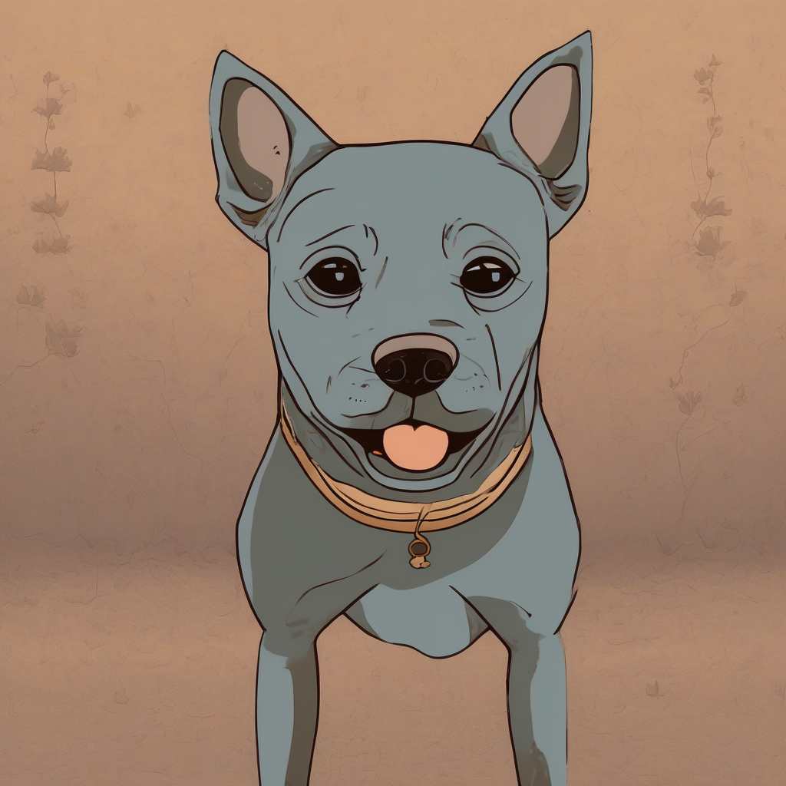

# Prompt-to-prompt (P2P) with SDXL
An implementation of [Prompt-to-Prompt](https://prompt-to-prompt.github.io/) for the SDXL architecture.

## What is Prompt-to-prompt (P2P)?
P2P is an editing technique that utilizes self- and cross-attention inherent in the diffusion process, and does not rely on external tools to make local and global edits.

It takes advantage of cross- and self-attention by generating two images at the same time: an original image, and another image (the result of the edit) with some modification in its prompt. For example, "a pink bear" and "a pink dragon". It then injects the attentions of "bear" to "dragon" during the diffusion, which in return preserves the style of the original image, but also replaces "bear" with "dragon".

For more information, I highly recommend checking out the original project page and paper of this work (linked below).

## Why use this implementation?
While Stable Diffusion is no longer state-of-the-art, it reamins a popular base model for ongoing research due to its well-established implementations. P2P is frequently cited and remains a significant foundation for work. To make sure good research is not left behind, it's worth updating its infrastructure. 

I hope this implementation encourages curious minds to explore the extent P2P's utility as Diffusion models continue to scale.

## What can I do with P2P?
P2P has three main operations, I'm including some examples below, but the official resources explain it in-depth.

### Replace
The replace operation swaps the effect of one token with a new token.

<table align="center">
  <tr>
    <td></td>
    <td></td>
  </tr>
  <tr>
    <td align="center">a pink <b>bear</b> riding a bicycle on the beach</td>
    <td align="center">a pink <b>dragon</b> riding a bicycle on the beach</td>
  </tr>
</table>

### Refine
The refine operation adds an effect to an existing token, for example, an adjective.

<table align="center">
  <tr>
    <td></td>
    <td></td>
  </tr>
  <tr>
    <td align="center">a chocolate cake</td>
    <td align="center">a <b>confetti</b> chocolate cake</td>
  </tr>
</table>

### Reweight
The reweight operation generates the same image, but amplifies or attenuates the effect of a target token in the prompt. Below is an example of an attenuation of "blue" in "a blue dog".

<table align="center">
  <tr>
    <td></td>
    <td></td>
  </tr>
  <tr>
    <td align="center"><b>Original:</b> a blue dog</td>
    <td align="center"><b>Attenuated:</b> a (less) blue dog</td>
  </tr>
</table>

## Credit
The original [Prompt-to-Prompt project](https://prompt-to-prompt.github.io/) and the great researchers who worked on it: [Amir Hertz](https://amirhertz.github.io/), [Ron Mokady](https://rmokady.github.io/), [Jay Tenenbaum](https://scholar.google.co.il/citations?user=VMWdOSkAAAAJ&hl=en), [Kfir Aberman](https://kfiraberman.github.io/), [Yael Pritch](https://research.google/people/yael-pritch-knaan/), [Daniel Cohen-Or](https://danielcohenor.com/).

This code builds on the [Huggingface's community pipeline](https://github.com/huggingface/diffusers/pull/4563) of Prompt-to-prompt (Stable Diffusion implementation), contributed by [UmerHA](https://github.com/UmerHA).
